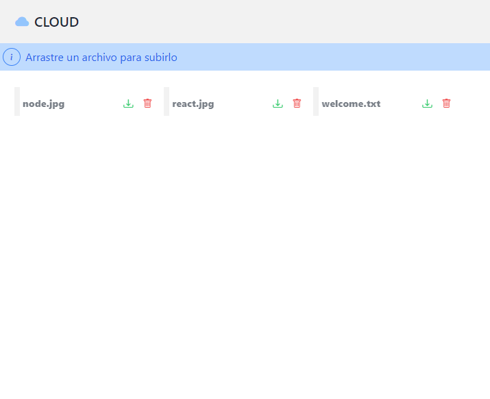
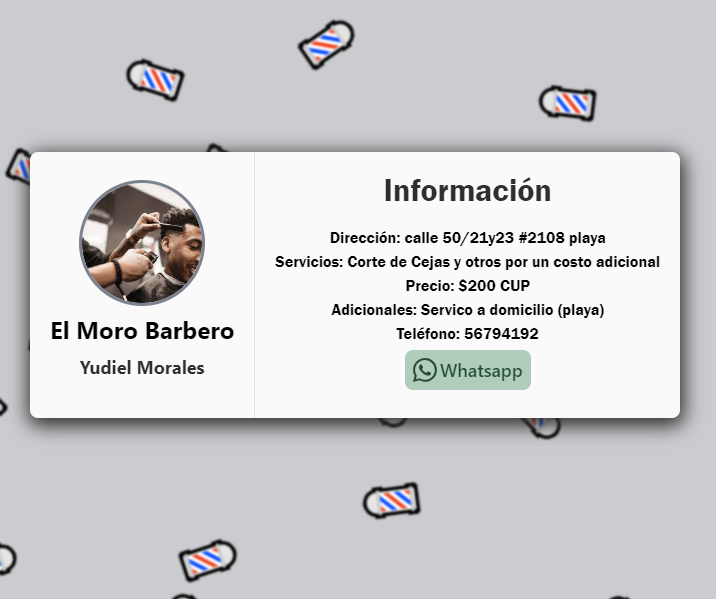

<h1>Hola 👋, mi nombre es Alejandro Jorgen</h1>
<h3>Me dedico al desaarrollo web 💻</h3>

<h3 align="left">Contacto:</h3>

    
    

<h3 align="left">Sobre mi:</h3>

    Tengo 24 años, entré al mundo de la programación a los 19 años cuando empecé a estudiar la carrera de ingeniería informática.

<h3 align="left">Proyectos de ejemplo:</h3>

<a href="https://uploadfilefront.onrender.com/" target="_blank" rel="noreferrer" style="display: flex; flex-flow: column">
    Subir archivo
    
</a>
<a href="https://barberyd.onrender.com/" target="_blank" rel="noreferrer" style="display: flex; flex-flow: column">
    Una divertida tarjeta de barbero
    
</a>

<h3 align="left">Lenguajes y habilidades:</h3>

    
    
    
    
    
    
    
    
    
    
    
    
    
    

&nbsp;

